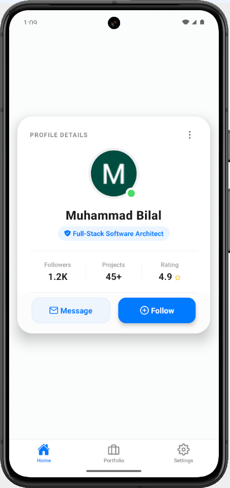
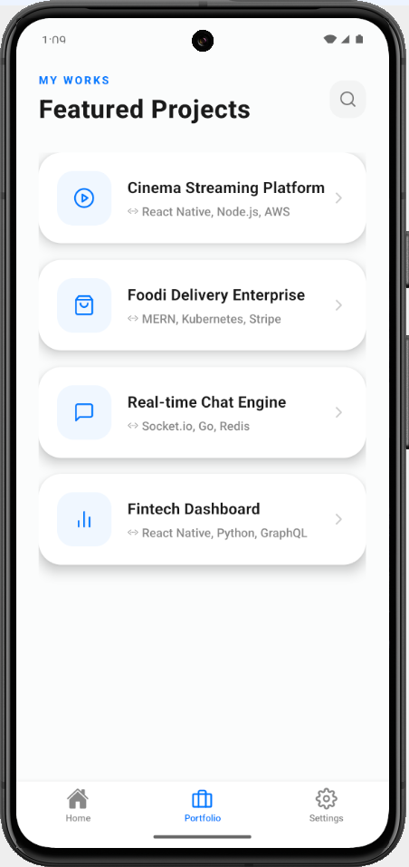
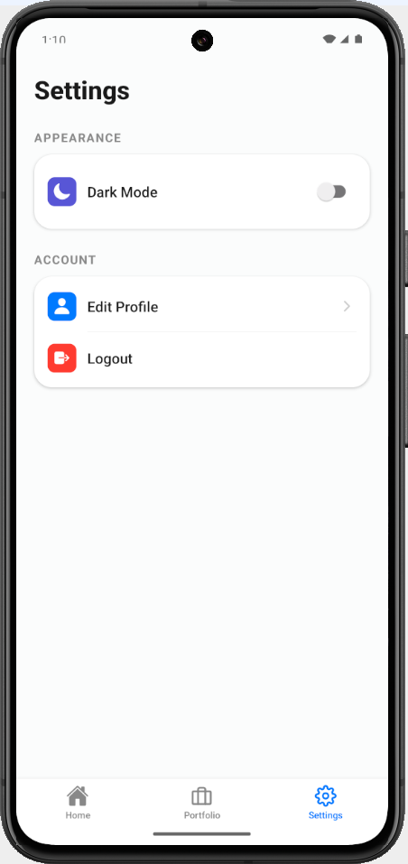
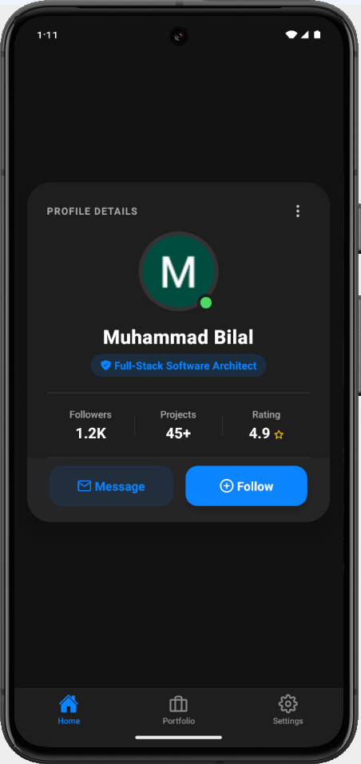
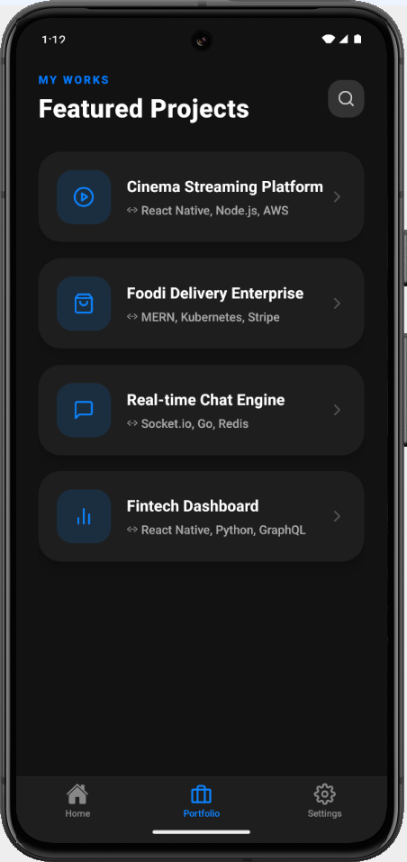
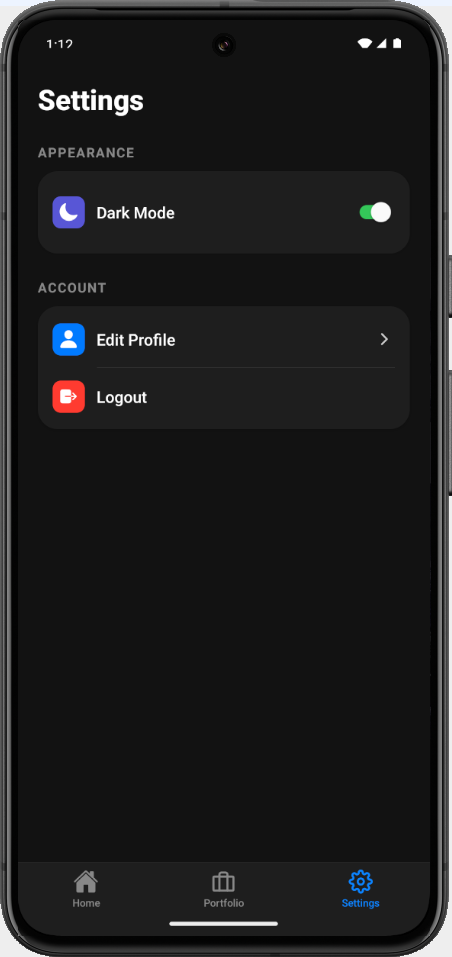
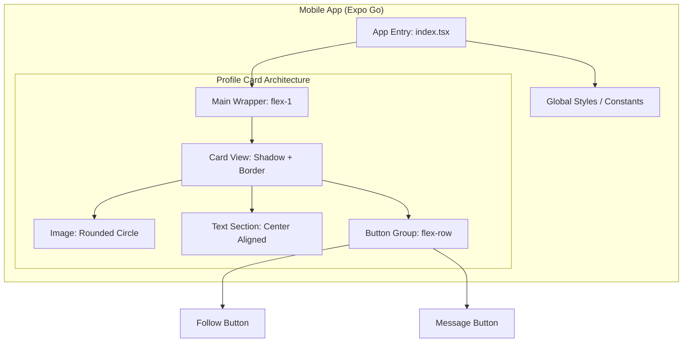

# 👤 ProfileCard · Flexbox-Based React Native UI Component

## 🏷️ Badges

---


## 📖 Executive Summary

---

Following the MernEats project series, this is a dedicated UI assignment designed to demonstrate a deep understanding of **React Native** and **Flexbox**. The primary objective of this project is to build a "Profile Card" component that is perfectly aligned, fully responsive, and adheres to mobile-first design principles. 

In this implementation, **Flexbox** properties—specifically `justifyContent`, `alignItems`, and `flexDirection`—have been utilized at a granular level to achieve a professional-grade user interface.

## 📸 Visual Tour

---

<p align="center">
  
  
  
</p>

<p align="center">
  
  
  
</p>

## 📊 High‑Level Architecture

---



## ✨ Core Modules & Capabilities

---

### 1) Layout Engine (Flexbox Mastery)

- Primary Axis Alignment: Utilized justifyContent: 'center' to ensure the card remains the focal point of the screen.
- Secondary Axis Alignment: Implemented alignItems: 'center' to horizontally align all internal elements (avatar, text, bio).
- Horizontal Button Row: Combined flexDirection: 'row' with justifyContent: 'space-between' to maintain a balanced and intuitive user experience for action buttons.

### 2) Component Styling & UX

- Rounded UI: Applied precise borderRadius calculations for a modern, circular profile avatar.
- Visual Feedback: Integrated touch-ready components with opacity feedback for better user interaction.
- Typography Hierarchy: Established a clear distinction between the User Name and Professional Role using font weights and color contrasts.

## 🧰 Technology Stack
---
| Layer     | Technology                                | Purpose                                                    |
| --------- | ----------------------------------------- | ---------------------------------------------------------- |
| Framework | React Native (Expo)                       | Cross-platform mobile development                          |
| Language  | TypeScript                                | Static typing and robust code architecture                |
| Layout    | Flexbox                                   | Precise UI positioning and adaptive spacing               |
| Tooling   | Expo Go / Metro Bundler                   | Real-time testing and development workflow                |
| State     | React Hooks (useState/useEffect)          | Component-level state management                           |
| Assets    | Local Images / Vector Icons               | High-quality visual elements and branding                  |

## 📂 Project Structure

---

```
Assignment_01/
├─ app/                    # Main application screens and logic
├─ assets/                 # Profile images and static media
├─ components/             # ProfileCard.tsx (Core Logic & Styles)
├─ constants/              # Theme colors and layout constants
├─ hooks/                  # Custom React hooks for logic reuse
├─ node_modules/           # Project dependencies
├─ package.json            # Metadata, scripts, and dependencies
└─ README.md               # Project documentation
```

## 📌 Implementation Highlights

---

- Responsive Layout: Used percentage-based widths (90%) and flexible containers to ensure compatibility across various screen sizes.
- Type Safety: Defined comprehensive TypeScript interfaces for handling component props (name, role, image source).
- Platform-Specific Shadows: Handled shadows for both Android (elevation) and iOS (shadowOpacity) for a consistent look.

## 🖥️ Screens Overview

---

- Home & Search: Hero search + advanced results with cuisine chips.Profile Display: A clean, centralized card view displaying user information.
- Action Group: Properly spaced "Follow" and "Message" buttons aligned in a single row as per technical requirements.


## 📜 License

---

All rights reserved. Assignment submitted for evaluation by Muhammad Bilal.
