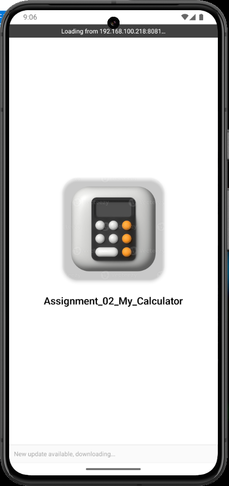
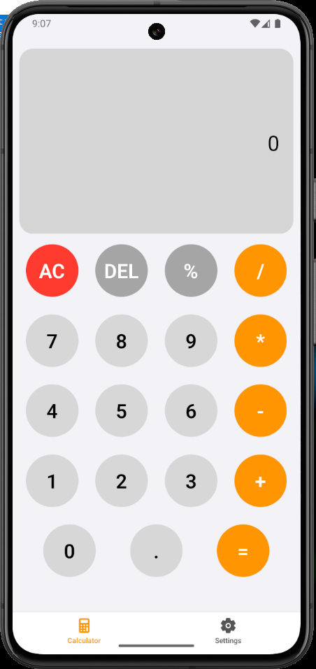
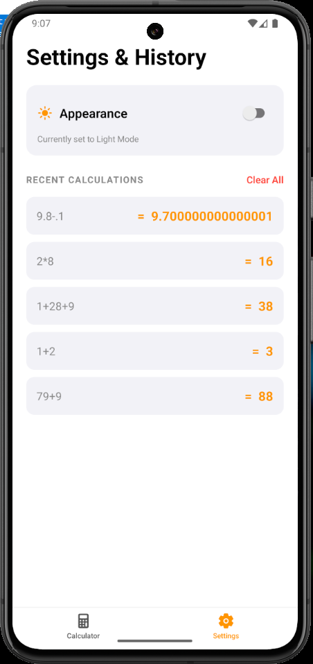
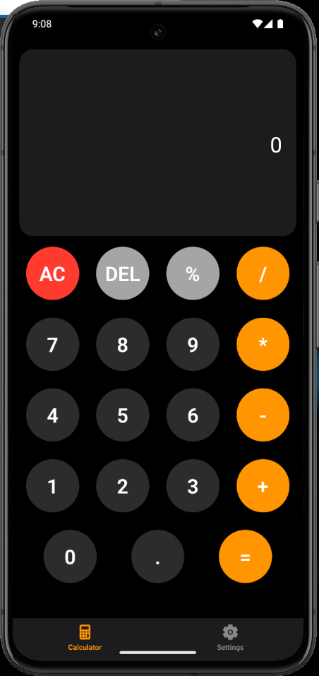
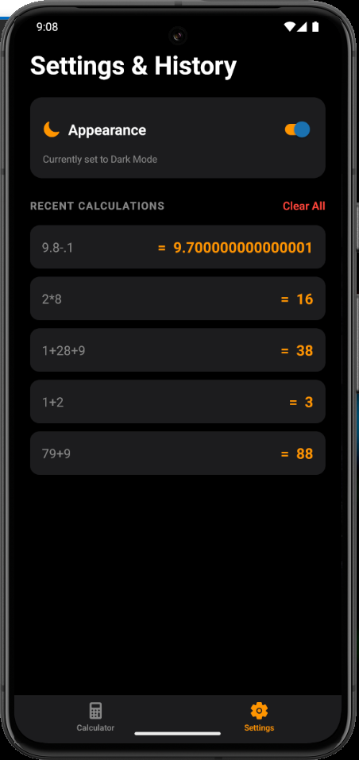
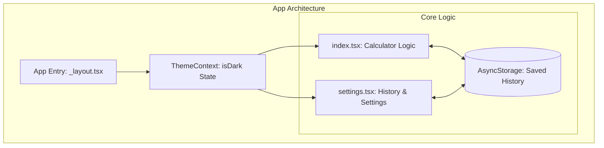

# 📱 My Calculator Pro · Feature-Rich React Native UI Component

## 🏷️ Badges

---


## 📖 Executive Summary

---

This project is an advanced React Native application that goes beyond basic arithmetic. It is a full-featured "Calculator Pro" utility designed with a focus on State Management, Theme Persistence, and User Experience.

Key highlights include a custom-built Theme Engine using React Context, Local Persistence for calculation history, and a modular architecture that separates business logic from UI components.

## 📸 Visual Tour

---

<p align="center">
  
</p>

<p align="center">
  
  
</p>

<p align="center">
  
  
</p>

## 📊 High‑Level Architecture

---



## ✨ Core Modules & Capabilities

---

### 1) Theme Engine (Dual-Mode Architecture)

- Context API Integration: Global theme state managed via a custom useTheme hook to ensure seamless transitions between Light and Dark modes.
- Theme Persistence: Leverages AsyncStorage to remember the user's appearance preference even after the app is closed.

### 2) Calculation & History Management

- Advanced Logic: Supports basic and advanced operations with real-time expression parsing.
- History Tracking: Automatically saves the last 5 calculations locally, providing a "Recent Calculations" view with a "Clear All" functionality.

### 3) UX & Interaction Design

- Tactile Feedback: Integrated Click Sound Effects using expo-av for every button interaction.
- Visual Hierarchy: Clear distinction between the current mathematical expression and the final result using dynamic font scaling.

## 🧰 Technology Stack
---
| Layer       | Technology                                | Purpose                                            |
| ----------- | ----------------------------------------- | -------------------------------------------------- |
| Framework   | React Native (Expo)                       | Cross-platform mobile architecture                 |
| State       | Context API & Hooks                       | Global theme and component-level state             |
| Storage     | AsyncStorage                              | Offline data persistence for history/theme         |
| Audio       | Expo AV                                   | Audio feedback for user interactions               |
| Navigation  | Expo Router (Tabs)                        | Seamless screen transitions                        |

## 📂 Project Structure

---

```
Assignment_02_My_Calculator/
├─ app/                 # Expo Router file-based navigation
│  ├─ (tabs)/           # Main Application Tab Screens
│  │  ├─ index.tsx      # Core Calculator Screen
│  │  └─ settings.tsx   # History & Appearance Settings
│  └─ _layout.tsx       # Root Layout with ThemeProvider
├─ context/             # ThemeContext.tsx (State Management)
├─ assets/              # Splash images & Audio files
├─ hooks/               # Custom hooks (useTheme, etc.)
└─ README.md            # Technical Documentation
```

## 📌 Implementation Highlights

---

- Platform Specific Styling: Custom shadows and elevations for Android/iOS consistency.
- Responsive Grid: Flexbox-based button grid that adapts to various screen dimensions and aspect ratios.
- Optimization: Minimal re-renders by decoupling the display logic from the history management.

## 📜 License

---

All rights reserved. Submitted for evaluation as part of the Mobile App Development course at MAJU.Developer: Muhammad Bilal
