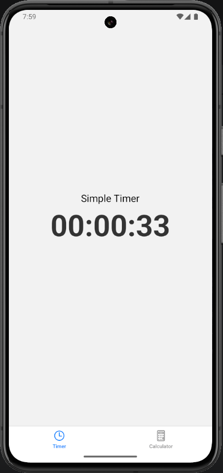
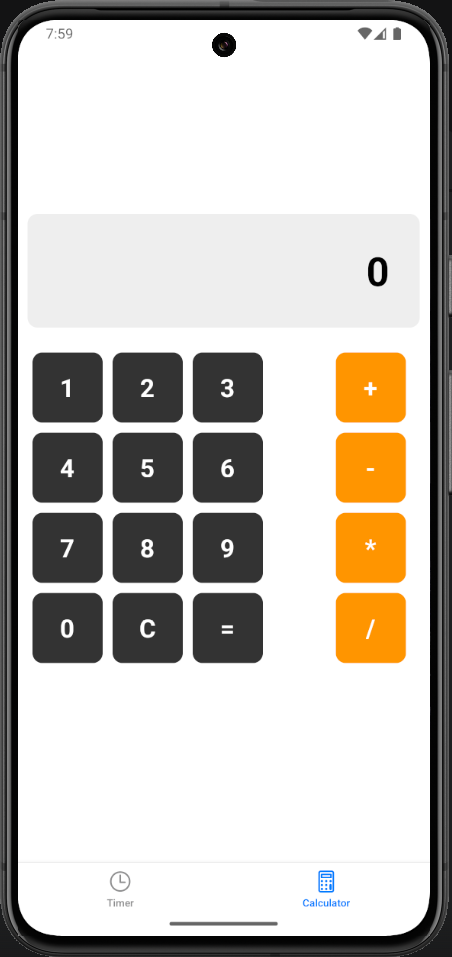
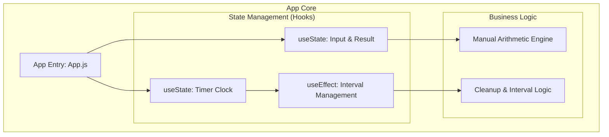

# 📱 My Calculator & Timer Pro · Feature-Rich React Native UI Component

## 🏷️ Badges
---


## 📖 Executive Summary

---

This project is a high-performance React Native application featuring a dual-utility suite: a **Pro Calculator** and a **Smart Timer**. Designed with a focus on modern UI principles, the app demonstrates advanced **State Management** using React Hooks and a robust **Manual Logic Engine** that avoids `eval()` for safer, more predictable calculations.

Key highlights include a responsive 3x3 + 1 grid architecture, real-time temporal tracking in the timer module, and a clean, minimalist design optimized for both mobile and web environments.

## 📸 Visual Tour

---

<p align="center">
  
  
</p>

## 📊 High‑Level Architecture

---



## ✨ Core Modules & Capabilities

---

### 1) Pro Calculation Engine (Non-Eval Logic)

- Manual Parsing: Unlike basic apps, this uses a state-driven approach to handle operations (+, -, *, /) independently, ensuring high precision and security.
- Dynamic Append: Real-time string manipulation allows users to build complex numbers (e.g., "123") seamlessly before triggering operations.

### 2) Smart Timer Utility

- Precision Tracking: Leverages setInterval within a useEffect hook to provide accurate second-by-second updates.
- Automatic Reset Logic: Features a built-in modulo-60 logic to reset seconds and increment minutes/hours automatically.
- Resource Management: Implements a robust Cleanup Function to prevent memory leaks and background battery drain.

### 3) UX & Layout Engineering

- Adaptive Grid: A custom Flexbox layout featuring a 3x3 numeric grid paired with a dedicated operations column for maximum thumb-reach ergonomics.
- Visual Feedback: High-contrast display screens with bold typography for instant readability.

## 🧰 Technology Stack
---
| Layer       | Technology                          | Purpose                                            |
| ----------- | ----------------------------------- | -------------------------------------------------- |
| Framework   | React Native (Expo)                 | Cross-platform mobile architecture                 |
| State       | Hooks (useState, useEffect)         | Reactive data binding and lifecycle management     |
| Layout     | Flexbox & StyleSheets                | Responsive UI design and component positioning     |
| Logic       | Pure JavaScript (ES6+)              | Business logic and arithmetic operations           |


## 📂 Project Structure

---

```
Assignment_My_Pro_Utility/
├─ app/                 
│  ├─ Calculator.js     # Core Arithmetic Screen (Manual Logic)
│  └─ Timer.js          # Smart Clock & Interval Screen
├─ assets/              # Static resources & splash images
├─ App.js               # Root Entry Point
└─ README.md            # Technical Documentation
```

## 📌 Implementation Highlights

---

- Zero-Dependency Calculation: Built without external math libraries or eval(), showcasing pure algorithmic thinking.
- Lifecycle Optimization: Uses dependency arrays in useEffect to ensure timers only run when the component is mounted.
- Responsive Geometry: Custom width-percentage scaling to ensure consistent button sizing across all screen aspect ratios.

## 📜 License

---

All rights reserved. Submitted for evaluation as part of the Mobile App Development course at MAJU.Developer: Muhammad Bilal
