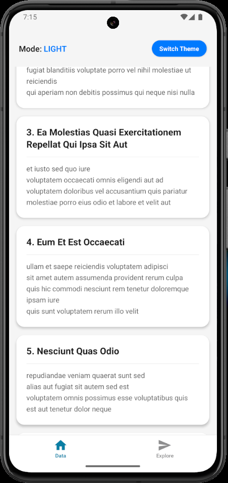
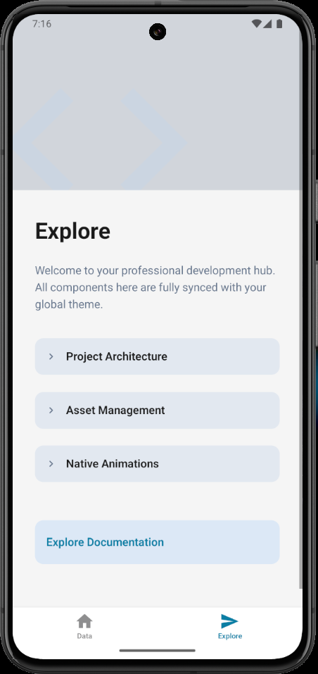
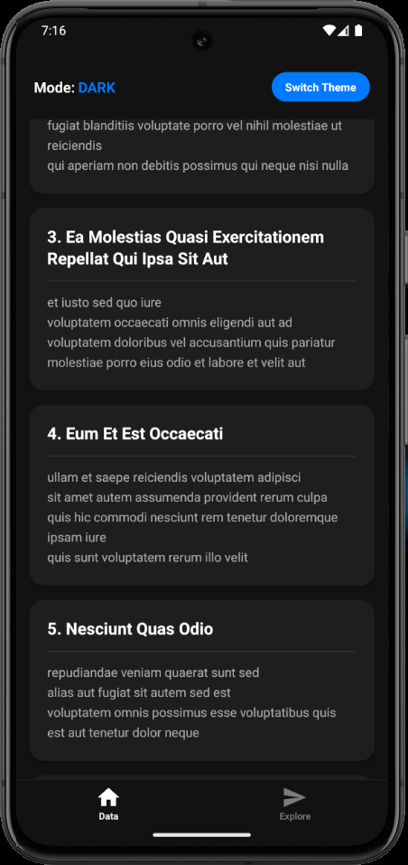
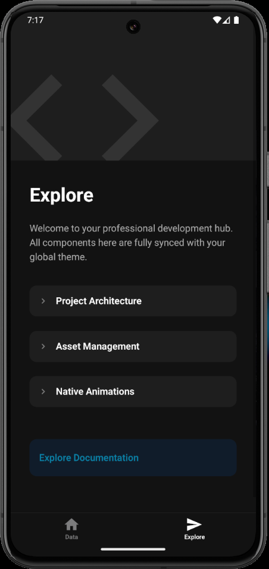
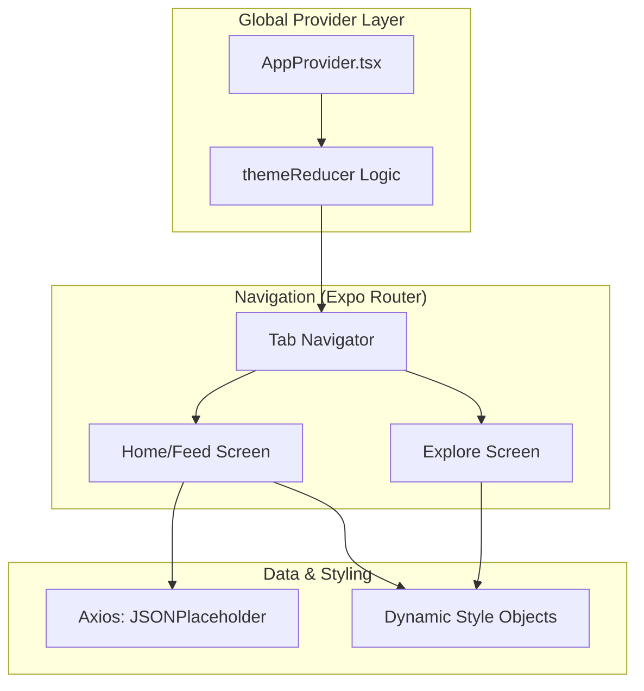

# 🌌 Synced-Core Lab-03 · Multi-Engine Dynamic Theme Hub

## 🏷️ Badges
---


## 📖 Executive Summary

---

Lab_03 is a sophisticated React Native demonstration project that bridges the gap between Global State Management and Asynchronous Data Integration. Developed as a professional-grade architectural template, it showcases a seamless Dynamic Theme Engine that synchronizes UI states across disconnected screens (Feed & Explore).

By utilizing a centralized Context-Reducer pattern, the application eliminates "Prop Drilling" and ensures that theme transitions (Light/Dark) are persistent and fluid, providing a high-end user experience optimized for modern mobile hardware.

## 📸 Visual Tour

---

<p align="center">
  
  
</p>

<p align="center">
  
  
</p>

## 📊 High‑Level Architecture

---



## ✨ Core Modules & Capabilities

---

### 1) Global Theme Engine (Context API)

- Centralized Dispatch: Implements useReducer to manage state transitions between light and dark modes.
- Cross-Screen Sync: Unlike standard hooks, this engine forces a re-render across the entire navigation stack, ensuring the TabBar and Headers update in real-time.

### 2) Asynchronous Data Pipeline

- Axios Integration: A robust implementation for fetching RESTful data from JSONPlaceholder.
- State-Driven UI: Features a professional ActivityIndicator system that handles 'Loading', 'Success', and 'Error' states gracefully during API calls.

### 3) Premium UI Engineering

- Parallax Scroll Architecture: The Explore screen uses an animated header system that responds to scroll velocity.
- Collapsible Module: Custom-built modular cards that use global context to adapt their internal styling without manual prop passing.
- Expo-Image Optimization: High-performance image rendering with built-in caching for asset management.

## 🧰 Technology Stack
---
| Layer          | Technology                | Purpose                                                   |
| -------------- | ------------------------- | --------------------------------------------------------- |
| Framework      | Expo 54 / React 19        | Cutting-edge mobile infrastructure                        |
| State          | Context + useReducer      | Global theme & persistent state management management     |
| Networking     | Axios                     | Optimized HTTP requests for external APIs positioning     |
| Animations     | Animations                | 60FPS fluid transitions and Parallax effects              |
| Type Safety    | TypeScript                | Robust architecture and scalable code-base                |


## 📂 Project Structure

---

```
Lab_03/
├── 📂 app/                     # Main Application Routing
│   ├── 📂 (tabs)/              # Tab-Based Navigation System
│   │   ├── 📄 index.tsx        # 🏠 Feed & Theme Toggle Engine
│   │   └── 📄 explore.tsx      # 🚀 Parallax Info & Architecture
│   └── 📄 _layout.tsx          # 🏗️ Root Provider & Theme Integration
├── 📂 src/                     # Source Logic
│   └── 📂 context/             # 🧠 State Management Core
│       ├── 📄 AppContext.ts    # 🔗 Context Initialization
│       └── 📄 AppProvider.tsx  # ⚡ Reducer & Provider Logic
├── 📂 components/              # 🧩 Reusable High-Order Components
│   ├── 📂 ui/                  # 🎨 Atomic UI Elements (Collapsibles, Icons)
│   └── 📄 themed-view.tsx      # 🌓 Theme-Aware Containers
├── 📂 assets/                  # 🖼️ High-Density Images & Branding
├── 📄 package.json             # 📦 Dependency Manifest
└── 📄 README.md                # 📖 Technical Documentation
```

## 📌 Implementation Highlights

---

- Zero Drift Sync: Total synchronization between Native Navigation components and Custom UI views using a single source of truth.
- Memory Optimization: Uses FlatList with optimized keyExtractor for handling infinite scroll data efficiently.
- Modular Component Design: Collapsible and Themed components are decoupled from the main screens for maximum reusability.

## 📜 License

---

All rights reserved. Submitted for evaluation as part of the Mobile App Development course at MAJU.Developer: Muhammad Bilal
