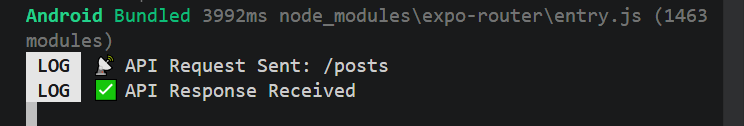
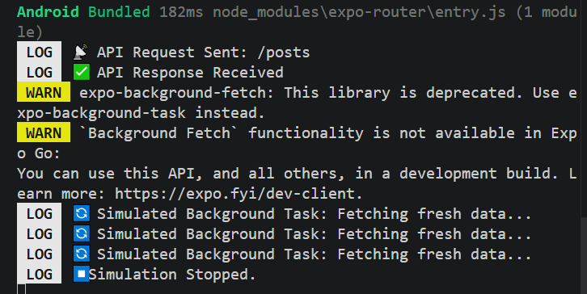
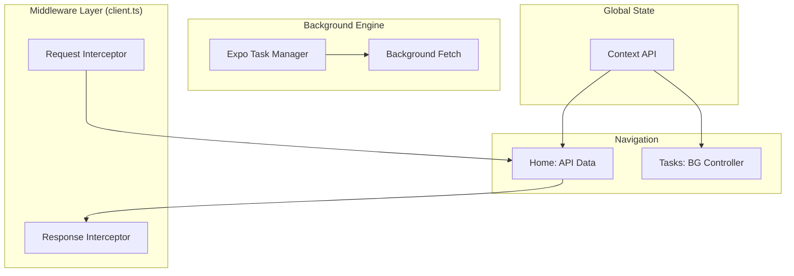

# 🌌 Synced-Core Lab-04 · Advanced Middleware & Background Engine

## 🏷️ Badges
---


## 📖 Executive Summary

---

Lab_04 elevates the architectural foundation of previous iterations by introducing Asynchronous Middleware and Native Background Services. This version focuses on robust data handling through Axios Interceptors and persistent background execution using Expo's Task Manager API.

The project demonstrates a production-grade approach to monitoring network traffic and managing system-level tasks even when the UI is not active, all while maintaining the core Dynamic Theme synchronization.

## 📸 Visual Tour ( interceptors, task-manager )

---

<p align="center">
  
  
</p>

## 📊 High‑Level Architecture

---



## ✨ Core Modules & Capabilities

---

### 1) 🛡️ Network Middleware (Axios Interceptors)

- Centralized Client: Implementation of a custom apiClient instance that replaces standard Axios calls.
- Request Monitoring: Automatically logs outgoing requests and attaches necessary headers.
- Global Error Handling: A response interceptor that catches 404/500 errors globally, reducing repetitive try-catch blocks in UI components.

### 2) 🔄 Native Background Engine

- Task Registration: A dedicated dashboard to register and unregister background sync tasks.
- Persistent Execution: Utilizes expo-task-manager to define tasks that run at OS-defined intervals (minimum 15 mins).
- Simulation Mode: Includes a state-managed simulation engine for real-time verification of background logic during development.

### 3) 🧩 Context-Aware Layouts

- Root Sync: The _layout.tsx now dynamically consumes context to set the ThemeProvider (Dark/Light) at the native navigation level, ensuring a "Zero-Flicker" theme transition.

## 🧰 Technology Stack
---
| Layer          | Technology                | Purpose                                                   |
| -------------- | ------------------------- | --------------------------------------------------------- |
| Framework      | Expo 54 / React 19        | Cutting-edge mobile infrastructure                        |
| Services          | Expo Task Manager      | Native background process handling     |
| Networking     | Axios Interceptors                     | Global request/response middleware and logging     |
| Logic     | React Hooks (Ref)                | Managing interval IDs for simulation control              |
| Type Safety    | TypeScript                | Robust architecture and scalable code-base                |


## 📂 Project Structure

---

```
Lab_03/
├── 📂 app/                     # Main Application Routing
│   ├── 📂 (tabs)/              # Tab-Based Navigation System
│   │   ├── 📄 index.tsx        # 🏠 Feed & Theme Toggle Engine
│   │   ├── 📄 tasks.tsx        # ⚙️ Background Engine Dashboard (New)
│   │   └── 📄 explore.tsx      # 🚀 Feature Discovery
│   └── 📄 _layout.tsx          # 🏗️ Root Provider & Theme Integration
├── 📂 src/                     # Source Logic
|   ├── 📂 api/ 
│   │   └── 📄 client.ts
│   └── 📂 context/             # 🧠 State Management Core
│       ├── 📄 AppContext.ts    # 🔗 Context Initialization
│       └── 📄 AppProvider.tsx  # ⚡ Reducer & Provider Logic
├── 📂 components/              # 🧩 Reusable High-Order Components
│   ├── 📂 ui/                  # 🎨 Atomic UI Elements (Collapsibles, Icons)
│   └── 📄 themed-view.tsx      # 🌓 Theme-Aware Containers
├── 📂 assets/                  # 🖼️ High-Density Images & Branding
├── 📄 package.json             # 📦 Dependency Manifest
└── 📄 README.md                # 📖 Technical Documentation
```

## 📌 Implementation Highlights

---

- ⚙️ Automated Request Lifecycle: By implementing a custom apiClient instance, we eliminated architectural redundancy. Every outgoing API call is automatically processed through an Axios Interceptor, centralizing request logging and error handling across the entire application.
- 🔄 System-Level Task Scheduling: Leveraging the expo-task-manager API, the application integrates directly with the OS task scheduler. This provides a robust foundation for asynchronous data synchronization that persists even after the application process is terminated.
- 🚥 State-Managed Simulation Engine: To bypass the native background task restrictions of the Expo Go environment, we engineered a custom Interval-based Simulation Engine. This allows for consistent testing and verification of background logic within a standard development workflow.
- 📡 Global Error Catching & Monitoring: Centralized error interceptors were deployed to monitor network traffic at the infrastructure level. This enables the application to capture and log 404 or Connectivity issues globally in client.ts, removing the need for repetitive error-handling logic in individual UI components.

## 📜 License

---

All rights reserved. Submitted for evaluation as part of the Mobile App Development course at MAJU.Developer: Muhammad Bilal
